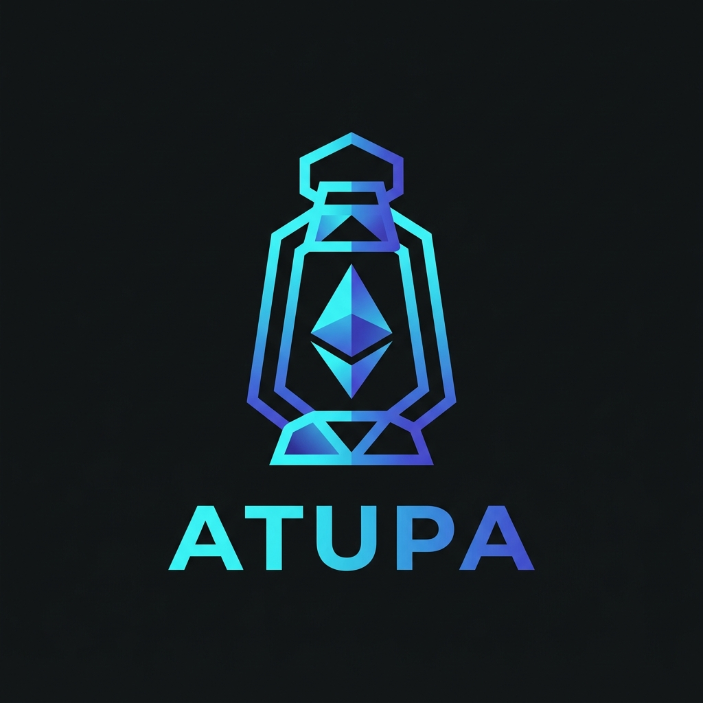

<p align="center">
  
</p>

<h1 align="center">Atupa</h1>

<p align="center">
  <strong>High-Fidelity Ethereum Tracing & Visual Profiling Suite</strong>
</p>

<p align="center">
  <a href="https://github.com/One-Block-Org/Atupa/actions"></a>
  <a href="https://crates.io/crates/atupa-core"></a>
  <a href="https://docs.rs/atupa-core"></a>
  <a href="https://opensource.org/licenses/MIT"></a>
</p>

---

**Atupa** (meaning *Lantern/Lamp*) is a professional-grade EVM execution profiler designed to turn raw JSON-RPC `debug_traceTransaction` logs into actionable visual insights. Whether you are debugging a complex DeFi reentrancy or optimizing a gas-intensive Uniswap v4 hook, Atupa sheds light on the internal state of every transaction.

## ✨ Key Features

- **🔥 Visual Flamegraphs**: Collapses thousands of EVM opcodes into hierarchical gas-weighted visualizations.
- **🚨 Crimson Revert Identification**: Instantly identifies failing sub-calls with high-contrast crimson gradients.
- **🔍 Smart Contract Resolution**: Automatically resolves hex addresses to verified contract names via Etherscan V2.
- **⚙️ Layered Configuration**: Robust configuration management via `atupa.toml`, environment variables, and CLI overrides.
- **🛠 Modular Library Architecture**: Pure Rust implementation with separate crates for RPC, Parsing, and Visualization.

## 🚀 Quick Start

### Installation

```bash
cargo install atupa
```

### Profiling a Transaction

```bash
# Profile a mainnet transaction
atupa profile --tx 0x... --rpc https://mainnet.infura.io/v3/YOUR_KEY

# Run the offline demo
atupa profile --demo
```

## 📦 Project Structure

Atupa is built as a highly modular monorepo:

| Crate | Description |
|-------|-------------|
| [`atupa`](crates/ethos-cli) | The primary command-line interface. |
| [`atupa-core`](crates/ethos-core) | Shared types and core configuration logic. |
| [`atupa-parser`](crates/ethos-parser) | The aggregation engine that collapses EVM traces. |
| [`atupa-rpc`](crates/ethos-rpc) | Async Ethereum JSON-RPC client & Etherscan resolver. |
| [`atupa-output`](crates/ethos-output) | SVG generation engine using Askama templates. |

## 🤝 Contributing

We welcome contributions! Please see our [Contributing Guidelines](CONTRIBUTING.md) for more details.

## 📄 License

Atupa is dual-licensed under the [MIT License](LICENSE-MIT) and the [Apache License 2.0](LICENSE-APACHE).
